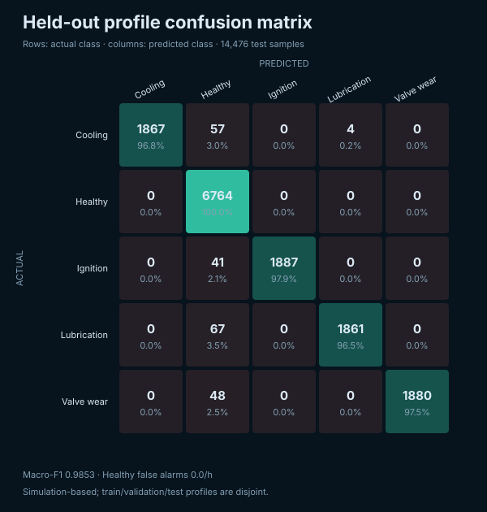

# AegisTwin model evaluation

> Simulation-based evidence. Profile IDs are separated across train, validation, and test.

| Metric | Result |
|---|---:|
| Macro-F1 | 0.9853 |
| Healthy false alarms/hour | 0.0 |
| Mean warning lead | 86.8 s |
| Median warning lead | 69.5 s |
| RUL MAE | 2.06 simulated min |
| RUL interval coverage | 92.0% |

The authoritative numeric source is `ml/models/metrics.json`.
